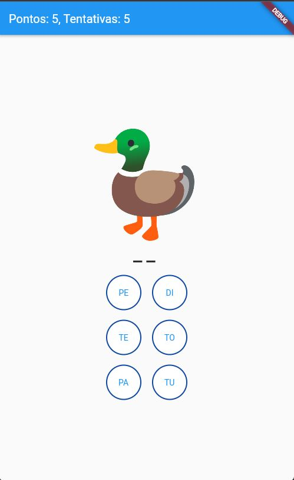

# Projeto Letramento:

Uma solução focada para auxiliar os professores da alfabetização do  Município de Igarassu, Pernambuco. Atualmente os professores utilizam cartas com sílabas para trabalhar a alfabetização de forma individualizada, uma vez que é preciso verificar qual conjunto silábico o aluno está com mais dificuldade, como o trabalho é feito de forma individual, requer um tempo considerável para o profissional de educação atender cada aluno. 
### Ideia inicial - Usuário vai:
1. Fazer um login através de suas credenciais: E-mail e matrícula, todos alunos tem um e-mail institucional.   
2. Ao logar, será apresentado uma imagem onde o aluno selecionará as sílabas correspondentes a imagem e com som de cada botão selecionado
3. Ao selecionar uma sílaba errada será armazenada a quantidade de erros para uma análise futura de desempenho do aluno.
4. Ao selecionar uma sílaba correta o aluno receberá uma pontuação.  
5. Serão verificadas as sílabas que foram erradas com mais frequência para se ter uma análise geral da turma.
   
### Apresentação:

### Demonstração do App

### Fluxo de Telas

### Telas

  
  
  
  
   
   
   
  

### Updates:
Atualizações no projeto serão destacadas neste local. O projeto está em constante atualização.

Orientador: Gilberto Amado De Azevedo Cysneiros Filho
